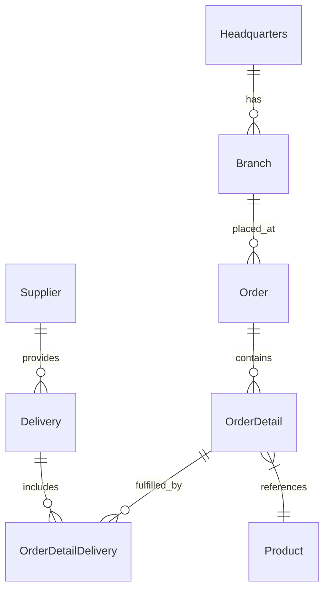

# Reducing Developer Toil — GitHub Copilot Workshop


> **Turn hours of repetitive work into minutes of AI-assisted flow.**

A hands-on workshop where enterprise developers tackle real developer toils using the latest GitHub Copilot features — Coding Agent, Agent Mode, Code Review, MCP Servers, Custom Instructions, Skills, Custom Agents, and more.

---

## Prerequisites

### Must-Have **Now**

| Requirement | Check |
|------------|-------|
| **GitHub account** | With **Copilot Enterprise** or **Copilot Business** license |
| **VS Code** | Latest version with [GitHub Copilot](https://marketplace.visualstudio.com/items?itemName=GitHub.copilot) + [Copilot Chat](https://marketplace.visualstudio.com/items?itemName=GitHub.copilot-chat) extensions |
| **Git** | Configured with credentials |

> ✅ **Have the above?** Skip to [Choose Your Path](#choose-your-path).

### Optional — Required Only for Specific Labs

| When needed | Requirement |
|--------|-------------|
| Before Labs 01, 03 | Org policy: Copilot Coding Agent & Code Review enabled |
| Starting Labs 04–05 | GitHub PAT ([create one](https://github.com/settings/tokens)) |
| If doing Lab 07 | GitHub Advanced Security enabled on repo |

---
## Choose Your Path

| Path | Time | For | Recommendation |
|------|------|-----|-----------------|
| [**Codespaces**](#path-codespaces) | 5–10 min | In-person workshops, no setup | ⭐ **Start here** |
| [**Docker Desktop**](#path-docker-desktop) | ~15 min | Already using Docker | ✅ Popular |
| [**Podman**](#path-podman) | ~15 min | Enterprise (Docker restricted) | ✅ Supported |
| [**Manual**](#path-manual) | ~20 min | Node.js v24+ already installed | Advanced |

---

<a id="path-codespaces"></a>
### Option A — GitHub Codespaces

**5–10 min | Zero setup**

1. On your fork: **Code** → **Codespaces** → **Create codespace on main**
2. Wait for setup (auto-installs dependencies and builds)
3. Authenticate (if prompted):
   ```shell
   gh auth login
   copilot login
   ```
4. ➜ **[Jump to Run Your First App](#run-your-first-app)**

<a id="path-docker-desktop"></a>
### Option B — VS Code + Docker Desktop

**~15 min | Has Docker**

1. Install [Dev Containers](https://marketplace.visualstudio.com/items?itemName=ms-vscode-remote.remote-containers) extension
2. Start Docker Desktop
3. Clone and open:
   ```bash
   git clone https://github.com/<your-username>/<your-repo-name>.git
   cd <your-repo-name>
   code .
   ```
4. Click **"Reopen in Container"** when prompted (or `Ctrl+Shift+P` → search "Reopen in Container")
5. Wait for build to finish
6. Authenticate (if prompted):
   ```shell
   gh auth login
   copilot login
   ```
7. ➜ **[Jump to Run Your First App](#run-your-first-app)**

<a id="path-podman"></a>
### Option C — VS Code + Podman

**~15 min | Enterprise/Docker restricted**

#### Step 1 — Install Podman

| Platform | Install Command / Method |
|----------|-------------------------|
| **macOS** | `brew install podman` or download from [podman.io](https://podman.io/docs/installation#macos) |
| **Windows** | Download installer from [podman.io](https://podman.io/docs/installation#windows) or `winget install RedHat.Podman` |
| **Linux (Fedora/RHEL)** | `sudo dnf install podman` |
| **Linux (Ubuntu/Debian)** | `sudo apt-get install podman` |
| **Linux (Arch)** | `sudo pacman -S podman` |

Also install the [Dev Containers](https://marketplace.visualstudio.com/items?itemName=ms-vscode-remote.remote-containers) extension in VS Code.

#### Step 2 — Initialize and Start Podman

<details>
<summary><strong>macOS</strong></summary>

```bash
# Initialize a Podman machine (only needed once)
podman machine init

# Start the machine
podman machine start

# Verify it's running
podman info
```

> **Apple Silicon (M1/M2/M3):** Podman automatically uses the native `applehv` virtualization. No extra configuration needed.

</details>

<details>
<summary><strong>Windows</strong></summary>

**Prerequisites:** WSL2 must be enabled. If not already enabled:
```powershell
# Run in PowerShell as Administrator
wsl --install

# Also enable Virtual Machine Platform (if not already)
dism.exe /online /enable-feature /featurename:VirtualMachinePlatform /all /norestart

# Restart your machine after these commands
```

After WSL2 is ready:
```powershell
# Initialize a Podman machine (only needed once)
podman machine init

# Start the machine
podman machine start

# Verify it's running
podman info
```

> **Using WSL2 backend:** Podman on Windows runs inside WSL2. If you encounter permission issues, try running from a WSL2 terminal.

</details>

<details>
<summary><strong>Linux (Rootless — Recommended)</strong></summary>

```bash
# Enable and start the Podman socket for your user (rootless)
systemctl --user enable --now podman.socket

# Verify the socket is running
systemctl --user status podman.socket

# Find your socket path (you'll need this for VS Code)
echo "Socket path: /run/user/$(id -u)/podman/podman.sock"

# Verify Podman works
podman info
```

> **Note:** Rootless Podman is the recommended mode for most users. It runs containers without root privileges.

</details>

<details>
<summary><strong>Linux (Root mode — if required by your org)</strong></summary>

```bash
# Enable and start the system-wide Podman socket
sudo systemctl enable --now podman.socket

# Verify it's running
sudo systemctl status podman.socket

# Socket will be at: /run/podman/podman.sock
```

</details>

#### Step 3 — Configure VS Code for Podman

Open VS Code Settings (`Ctrl+,` or `Cmd+,`) and add these settings:

**All platforms:**
```json
{
  "dev.containers.dockerPath": "podman"
}
```

**Linux only (rootless) — also add:**
```json
{
  "dev.containers.dockerSocketPath": "/run/user/1000/podman/podman.sock"
}
```
> Replace `1000` with your actual UID. Find it by running `id -u` in your terminal.

**Linux only (root mode) — also add:**
```json
{
  "dev.containers.dockerSocketPath": "/run/podman/podman.sock"
}
```

#### Step 4 — Clone and Open

```bash
git clone https://github.com/<your-username>/<your-repo-name>.git
cd <your-repo-name>
code .
```

#### Step 5 — Reopen in Container

1. Click **"Reopen in Container"** when prompted  
   (or press `Ctrl+Shift+P` / `Cmd+Shift+P` → search "Reopen in Container")
2. Wait for the container build to complete

#### Step 6 — Authenticate

```shell
gh auth login
copilot login
```

➜ **[Jump to Run Your First App](#run-your-first-app)**

---

#### Podman Troubleshooting

<details>
<summary><strong>Container fails to start</strong></summary>

1. Verify Podman is running:
   ```bash
   podman info
   ```
2. Check the socket path matches your VS Code settings
3. On macOS/Windows, ensure the machine is started:
   ```bash
   podman machine start
   ```

</details>

<details>
<summary><strong>Permission denied errors (Linux)</strong></summary>

For rootless Podman, ensure the socket is enabled for your user:
```bash
systemctl --user enable --now podman.socket
```

If using SELinux, you may need to adjust labels:
```bash
# Add :Z suffix for SELinux volume relabeling
podman run -v ./mydir:/container/path:Z ...
```

</details>

<details>
<summary><strong>Podman machine won't start (Windows)</strong></summary>

1. Ensure WSL2 is properly installed and enabled
2. Check Virtual Machine Platform is enabled:
   ```powershell
   # Run as Administrator
   dism.exe /online /enable-feature /featurename:VirtualMachinePlatform /all /norestart
   ```
3. Restart your machine
4. Try initializing a fresh machine:
   ```bash
   podman machine rm podman-machine-default
   podman machine init
   podman machine start
   ```

</details>

<details>
<summary><strong>Enterprise proxy or CA certificate issues</strong></summary>

Your organization may require custom CA certificates in the Podman VM.

**macOS/Windows:**
```bash
# SSH into the Podman machine
podman machine ssh

# Add your certificate (inside the VM)
sudo cp /path/to/your-ca-cert.pem /etc/pki/ca-trust/source/anchors/
sudo update-ca-trust
```

**For detailed instructions:** See [Podman CA Certificate Guide](https://github.com/containers/podman/blob/main/docs/tutorials/podman-install-certificate-authority.md)

**Proxy configuration (if behind corporate proxy):**
```bash
# Set proxy for Podman machine
podman machine ssh
export HTTP_PROXY=http://proxy.example.com:8080
export HTTPS_PROXY=http://proxy.example.com:8080
export NO_PROXY=localhost,127.0.0.1
```

Or add to `~/.config/containers/containers.conf`:
```ini
[engine]
env = ["HTTP_PROXY=http://proxy.example.com:8080", "HTTPS_PROXY=http://proxy.example.com:8080"]
```

</details>

<details>
<summary><strong>Using podman-compose (alternative to Docker Compose)</strong></summary>

If your environment doesn't support Docker Compose commands:
```bash
# Install podman-compose
pip install podman-compose

# Or on Fedora/RHEL
sudo dnf install podman-compose

# Use it like docker-compose
podman-compose up -d
```

> **Note:** The Dev Containers extension handles compose automatically when `dockerPath` is set to `podman`.

</details>

<a id="path-manual"></a>
### Option D — Manual Setup

If you prefer to install all tools directly on your machine:

**Manual path prerequisites:**

- Node.js **v24+** (includes npm)
- Git
- GNU Make (`make`) available in your shell
- VS Code with GitHub Copilot + Copilot Chat extensions
- GitHub account with Copilot Business or Enterprise

1. Confirm prerequisites are installed (see [Prerequisites](#prerequisites) above)
2. Clone your repository:
   ```bash
   git clone https://github.com/<your-username>/<your-repo-name>.git
   cd <your-repo-name>
   ```
3. Install dependencies and build:
   ```bash
   make install
   make build
   ```
   If `make` is not available on your machine, use:
   ```bash
   cd api && npm install && npm run build
   cd ../frontend && npm install && npm run build
   ```
4. Authenticate:
   ```shell
   gh auth login
   copilot login
   ```
5. Continue with [Run Your First App](#run-your-first-app)

---
## Run Your First App

### 1. Create Your Repo

1. **Fastest:** Click **Fork** and fork this repo to your account (default name is fine)
2. **If forking is restricted:** click **"Use this template"** to create a new repo
3. Keep the default repo name or choose your own

> Each of you gets a personal repo for doing Coding Agent labs and GitHub integration exercises.

### 2. Start the Services

Your environment is already set up and dependencies are installed. Open **two terminals**:

**Terminal 1 — API:**
```bash
cd api
npm run dev
```
Look for: `Server is running on port 3000`

**Terminal 2 — Frontend:**
```bash
cd frontend
npm run dev
```
Look for: `Local: http://localhost:5137/`

### 3. ✅ Success Check

Open these URLs (or click port links in VS Code):

| What | URL | Expect |
|------|-----|--------|
| **API Docs** | http://localhost:3000/api-docs/ | Swagger UI showing endpoints |
| **Frontend** | http://localhost:5137 | React dashboard with products listed |

**Both load with content?** → 🎉 Ready for the labs!

---
## Troubleshooting Setup

| Problem | Quick Fix |
|---------|-----------|
| Port already in use | `npx kill-port 3000 5137` |
| Blank API docs page | Add trailing slash: `http://localhost:3000/api-docs/` |
| Container stuck | VS Code → **Developer: Reload Window** |
| Still stuck | **Dev Containers: Rebuild Container** |
| Can't reach frontend | Check VS Code **Ports** panel for 5137 forwarding |

> More help under [Troubleshooting](#troubleshooting).

---
## Quick Start (5 min)

### 1. Create Your Repo (Fork First)

1. **Recommended (fastest):** Click **Fork** and create a fork under your own account/org.
2. **Fallback:** If your org blocks forks, use **Code → Use this template → Create a new repository**.
3. Keep the default name or pick any name, then create the repo.

> **Why fork first?** It is usually one click faster and still gives each attendee a personal repo with push access for Coding Agent PRs, Code Review, and GitHub Advanced Security labs.

### 2. Set Up Your Environment

Choose one of the options from [Choose Your Path](#choose-your-path) above:
- **Codespaces** — Zero local install (recommended)
- **Docker Desktop** — Standard Docker
- **Podman** — Enterprise/restricted Docker environments
- **Manual Setup** — Direct installation

Once your environment is ready, the dependencies will be automatically installed and the project will be built.

---
## The Application

**OctoCAT Supply** is a supply chain management system built with a modern TypeScript stack. You'll use it throughout every lab.

```
Frontend (React + Vite + Tailwind)  →  API (Express.js + TypeScript)  →  SQLite
```



---

## Labs

> **Pick the toils that hurt your team most, or crush them all.**
>
> Each lab is **standalone** (no dependencies between labs). Times show **core exercises → all exercises**.

### Backlog Cleanup & Boilerplate

| Lab | Title | Toil Solved | Copilot Feature | Time |
|-----|-------|-------------|----------------|------|
| [01](workshop/labs/lab-01-coding-agent/README.md) | **Zero to PR** | Translating issues to code | Coding Agent | 15–50 min |
| [02](workshop/labs/lab-02-agent-mode/README.md) | **Feature Build** | Scaffolding components | Agent Mode | 30–55 min |
| [09](workshop/labs/lab-09-github-skills/README.md) | **Teach Copilot Your Patterns** | Repeating entity patterns | Copilot Skills | 30–55 min |

### Code Hygiene & Standards

| Lab | Title | Toil Solved | Copilot Feature | Time |
|-----|-------|-------------|----------------|------|
| [03](workshop/labs/lab-03-code-review/README.md) | **AI First-Pass Review** | PR review bottleneck | Code Review + Custom Agent | 20–55 min |
| [05](workshop/labs/lab-05-custom-instructions/README.md) | **Team Standards as Code** | Manual standards enforcement | Custom Instructions | 25–55 min |
| [08](workshop/labs/lab-08-documentation/README.md) | **Self-Documenting Code** | Writing documentation | Agent Mode + Doc Agent | 20–55 min |
| [10](workshop/labs/lab-10-custom-agents/README.md) | **Build Your Own Agent** | Specialized workflows | Custom Agents | 15–50 min |

### Testing & Quality

| Lab | Title | Toil Solved | Copilot Feature | Time |
|-----|-------|-------------|----------------|------|
| [06](workshop/labs/lab-06-parallel-delegation/README.md) | **Agent HQ: Batch It** | Sequential small tasks | Parallel Agents + Agent HQ | 15–50 min |
| [07](workshop/labs/lab-07-security-autofix/README.md) | **Zero-Day to Zero-Effort** | Fixing vulnerabilities | Security Autofix + Agent | 20–50 min |

### Tools & Integration

| Lab | Title | Toil Solved | Copilot Feature | Time |
|-----|-------|-------------|----------------|------|
| [04](workshop/labs/lab-04-mcp-servers/README.md) | **Connect Your Tools** | Context switching | MCP Servers | 20–60 min |

---

## Toil Scorecard

Each lab includes a **Toil Scorecard** — estimate your before/after as you go:

| Metric | Without Copilot (est.) | With Copilot (est.) | Savings |
|--------|----------------------|-------------------|---------|
| Time to complete | ___ min | ___ min | ___% |
| Lines coded manually | ___ | ___ | ___% |
| Context switches | ___ | ___ | ___% |
| Errors/rework cycles | ___ | ___ | ___% |

> **At the end of the workshop**, calculate your total: hours saved × 50 weeks × team size = **annual hours reclaimed**.

---

## Agents & Skills Created During Labs

By the end of the workshop, you'll have created these reusable assets:

| Asset | Type | Created In |
|-------|------|-----------|
| Code Reviewer | Agent | Lab 03 |
| Project Status | Agent | Lab 04 |
| Security Reviewer | Agent | Lab 07 |
| Doc Generator | Agent | Lab 08 |
| Codebase Navigator | Agent | Lab 10 |
| PR Review Pipeline | Agent | Lab 10 |
| Frontend Component | Skill | Lab 09 |

---

## Useful Commands

| Task | Command |
|------|--------|
| Install all deps | `cd api && npm install && cd ../frontend && npm install` |
| Dev mode (API) | `cd api && npm run dev` |
| Dev mode (Frontend) | `cd frontend && npm run dev` |
| Run all tests | `cd api && npm test && cd ../frontend && npm test` |
| Build both projects | `cd api && npm run build && cd ../frontend && npm run build` |
| Lint both projects | `cd api && npm run lint && cd ../frontend && npm run lint` |
| Reset database | `cd api && npm run db:migrate && npm run db:seed` |
| Clean artifacts | Delete `node_modules/` and `dist/` in `api/` and `frontend/` |

---

## Reference

| Resource | Description |
|----------|-------------|
| [Architecture](./docs/architecture.md) | Detailed system design |
| [SQLite Integration](./docs/sqlite-integration.md) | Database patterns and config |

---

## Troubleshooting

### General Issues

| Problem | Fix |
|---------|-----|
| Port 3000 / 5137 in use | `npx kill-port 3000 5137` |
| npm install fails | Delete `node_modules` in `api/` and `frontend/`, re-run install |
| Copilot not responding | Check the Copilot extension is signed in and enabled |
| MCP servers not loading | Restart VS Code, check `.vscode/mcp.json` config |
| Coding Agent not available | Verify org policy enables Coding Agent |
| CodeQL not running | Enable GitHub Advanced Security in repo settings *(only needed for Lab 07)* |

### Podman Issues

> For detailed Podman troubleshooting with step-by-step solutions, see the [Podman Troubleshooting section](#podman-troubleshooting) in the setup instructions above.

| Problem | Quick Fix |
|---------|-----------|
| **WSL2/Virtual Machine Platform not enabled** (Windows) | Run in **PowerShell as Administrator**: `dism.exe /online /enable-feature /featurename:VirtualMachinePlatform /all /norestart` then `wsl --install`, restart |
| **Machine fails to start** (Windows/macOS) | Verify machine is initialized: `podman machine init` then `podman machine start` |
| **Socket not found** (Linux rootless) | Enable the Podman socket: `systemctl --user enable --now podman.socket` |
| **Socket not found** (Linux root) | Enable system socket: `sudo systemctl enable --now podman.socket` |
| **Dev Container fails with Podman** | Verify VS Code setting: `"dev.containers.dockerPath": "podman"`. On Linux, also set: `"dev.containers.dockerSocketPath": "/run/user/$(id -u)/podman/podman.sock"` |
| **Permission denied** (Linux) | For rootless, check socket ownership; for SELinux systems, use `:Z` volume suffix |
| **Corporate proxy issues** | Configure proxy in `~/.config/containers/containers.conf` or inside `podman machine ssh` |
| **CA certificate errors** | Add custom certs to Podman VM; see [Podman CA Certificate Guide](https://github.com/containers/podman/blob/main/docs/tutorials/podman-install-certificate-authority.md) |

---

*Built with GitHub Copilot.*
