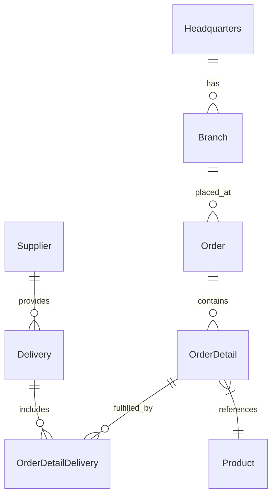

# Reducing Developer Toil — GitHub Copilot Workshop


> **Turn hours of repetitive work into minutes of AI-assisted flow.**

A hands-on workshop where enterprise developers tackle real developer toils using the latest GitHub Copilot features — Coding Agent, Agent Mode, Code Review, MCP Servers, Custom Instructions, Skills, Custom Agents, and more.

---

## 🚀 30-Second Start

| Step | Action |
|------|--------|
| **1. Fork** | Click **Fork** at the top of this page |
| **2. Open** | In your fork: **Code** → **Codespaces** → **Create codespace on main** |
| **3. Wait** | Setup runs automatically (~3 min) |
| **4. Start** | Run `make dev` in the terminal |
| **5. Done!** | Open http://localhost:5137 |

> **That's it!** Copilot extension authenticates automatically. GitHub CLI is auto-configured in Codespaces.
>
> ⬇️ Not using Codespaces? See [Other Setup Options](#choose-your-path) below.

---

## Prerequisites

### Must-Have **Now**

| Requirement | Check |
|------------|-------|
| **GitHub account** | With **Copilot Enterprise** or **Copilot Business** license |
| **VS Code** | Latest version with [GitHub Copilot](https://marketplace.visualstudio.com/items?itemName=GitHub.copilot) + [Copilot Chat](https://marketplace.visualstudio.com/items?itemName=GitHub.copilot-chat) extensions |
| **Git** | Configured with credentials |

> ✅ **Have the above?** Skip to [Choose Your Path](#choose-your-path).

### Optional — Required Only for Specific Labs

| When needed | Requirement |
|--------|-------------|
| Before Labs 01, 03 | Org policy: Copilot Coding Agent & Code Review enabled |
| Starting Labs 04–05 | GitHub PAT ([create one](https://github.com/settings/tokens)) |
| If doing Lab 07 | GitHub Advanced Security enabled on repo |

---
## Choose Your Path

| Path | Time | For | Recommendation |
|------|------|-----|-----------------|
| [**Codespaces**](#path-codespaces) | ~3 min | In-person workshops, no setup | ⭐ **Start here** |
| [**Docker Desktop**](#path-docker-desktop) | ~10 min | Already using Docker | ✅ Popular |
| [**Podman**](#path-podman) | ~15 min | Enterprise (Docker restricted) | ✅ Supported |
| [**Manual**](#path-manual) | ~15 min | Node.js v24+ already installed | Advanced |

---

<a id="path-codespaces"></a>
### Option A — GitHub Codespaces

**~3 min | Zero setup | ⭐ Recommended**

1. On your fork: **Code** → **Codespaces** → **Create codespace on main**
2. Wait for setup (auto-installs dependencies, builds, and configures GitHub CLI)
3. Run `make dev` to start both servers
4. ➜ **[Jump to Verify It Works](#verify-it-works)**

> 💡 **Copilot authenticates automatically** via the VS Code extension — no manual login needed.

<a id="path-docker-desktop"></a>
### Option B — VS Code + Docker Desktop

**~10 min | Has Docker**

1. Install [Dev Containers](https://marketplace.visualstudio.com/items?itemName=ms-vscode-remote.remote-containers) extension
2. Start Docker Desktop
3. Clone and open:
   ```bash
   git clone https://github.com/<your-username>/<your-repo-name>.git
   cd <your-repo-name>
   code .
   ```
4. Click **"Reopen in Container"** when prompted (or `Ctrl+Shift+P` → search "Reopen in Container")
5. Wait for build to finish
6. Authenticate GitHub CLI (if needed): `gh auth login`
7. Run `make dev` to start both servers
8. ➜ **[Jump to Verify It Works](#verify-it-works)**

> 💡 **Copilot authenticates automatically** via the VS Code extension.

<a id="path-podman"></a>
### Option C — VS Code + Podman

**~15 min | Enterprise/Docker restricted**

1. Install Podman for your platform ([installation guide](./docs/podman-setup.md#installation))
2. Install the [Dev Containers](https://marketplace.visualstudio.com/items?itemName=ms-vscode-remote.remote-containers) extension
3. Initialize and start Podman:
   ```bash
   podman machine init   # macOS/Windows only, one-time
   podman machine start  # macOS/Windows only
   podman info           # Verify it works
   ```
4. Configure VS Code — add to settings (`Ctrl+,`):
   ```json
   { "dev.containers.dockerPath": "podman" }
   ```
   > Linux users: Also set `dockerSocketPath`. See [full Podman setup](./docs/podman-setup.md#configure-vs-code).

5. Clone, open, and reopen in container:
   ```bash
   git clone https://github.com/<your-username>/<your-repo-name>.git
   cd <your-repo-name> && code .
   ```
   Then: `Ctrl+Shift+P` → "Reopen in Container"

6. Authenticate GitHub CLI: `gh auth login`
7. Run `make dev` to start both servers
8. ➜ **[Jump to Verify It Works](#verify-it-works)**

> 💡 **Copilot authenticates automatically** via the VS Code extension.
>
> 🔧 **Having issues?** See the [Podman troubleshooting guide](./docs/podman-setup.md#troubleshooting).

<a id="path-manual"></a>
### Option D — Manual Setup

**~15 min | Node.js v24+ already installed**

**Prerequisites:** Node.js v24+, Git, GNU Make, VS Code with Copilot extensions

1. Clone your forked repository:
   ```bash
   git clone https://github.com/<your-username>/<your-repo-name>.git
   cd <your-repo-name>
   ```
2. Install dependencies and build:
   ```bash
   make install && make build
   ```
   Or without Make: `cd api && npm install && npm run build && cd ../frontend && npm install && npm run build`
3. Authenticate GitHub CLI: `gh auth login`
4. Run `make dev` to start both servers
5. ➜ **[Jump to Verify It Works](#verify-it-works)**

> 💡 **Copilot authenticates automatically** via the VS Code extension.

---

<a id="verify-it-works"></a>
## ✅ Verify It Works

After running `make dev`, check these URLs:

| What | URL | Expect |
|------|-----|--------|
| **Frontend** | http://localhost:5137 | React dashboard with products listed |
| **API Docs** | http://localhost:3000/api-docs/ | Swagger UI showing endpoints |

**Both load?** → 🎉 You're ready for the labs!

<details>
<summary><strong>Quick troubleshooting</strong></summary>

| Problem | Fix |
|---------|-----|
| Port already in use | `npx kill-port 3000 5137` |
| Blank API docs page | Add trailing slash: `/api-docs/` |
| Container stuck | VS Code → **Developer: Reload Window** |
| Can't reach frontend | Check VS Code **Ports** panel for 5137 forwarding |

</details>

---
## The Application

**OctoCAT Supply** is a supply chain management system built with a modern TypeScript stack. You'll use it throughout every lab.

```
Frontend (React + Vite + Tailwind)  →  API (Express.js + TypeScript)  →  SQLite
```



---

## Labs

> **Pick the toils that hurt your team most, or crush them all.**
>
> Each lab is **standalone** (no dependencies between labs). Times show **core exercises → all exercises**.

### Backlog Cleanup & Boilerplate

| Lab | Title | Toil Solved | Copilot Feature | Time |
|-----|-------|-------------|----------------|------|
| [01](workshop/labs/lab-01-coding-agent/README.md) | **Zero to PR** | Translating issues to code | Coding Agent | 15–50 min |
| [02](workshop/labs/lab-02-agent-mode/README.md) | **Feature Build** | Scaffolding components | Agent Mode | 30–55 min |
| [09](workshop/labs/lab-09-github-skills/README.md) | **Teach Copilot Your Patterns** | Repeating entity patterns | Copilot Skills | 30–55 min |

### Code Hygiene & Standards

| Lab | Title | Toil Solved | Copilot Feature | Time |
|-----|-------|-------------|----------------|------|
| [03](workshop/labs/lab-03-code-review/README.md) | **AI First-Pass Review** | PR review bottleneck | Code Review + Custom Agent | 20–55 min |
| [05](workshop/labs/lab-05-custom-instructions/README.md) | **Team Standards as Code** | Manual standards enforcement | Custom Instructions | 25–55 min |
| [08](workshop/labs/lab-08-documentation/README.md) | **Self-Documenting Code** | Writing documentation | Agent Mode + Doc Agent | 20–55 min |
| [10](workshop/labs/lab-10-custom-agents/README.md) | **Build Your Own Agent** | Specialized workflows | Custom Agents | 15–50 min |

### Testing & Quality

| Lab | Title | Toil Solved | Copilot Feature | Time |
|-----|-------|-------------|----------------|------|
| [06](workshop/labs/lab-06-parallel-delegation/README.md) | **Agent HQ: Batch It** | Sequential small tasks | Parallel Agents + Agent HQ | 15–50 min |
| [07](workshop/labs/lab-07-security-autofix/README.md) | **Zero-Day to Zero-Effort** | Fixing vulnerabilities | Security Autofix + Agent | 20–50 min |

### Tools & Integration

| Lab | Title | Toil Solved | Copilot Feature | Time |
|-----|-------|-------------|----------------|------|
| [04](workshop/labs/lab-04-mcp-servers/README.md) | **Connect Your Tools** | Context switching | MCP Servers | 20–60 min |

---

## Toil Scorecard

Each lab includes a **Toil Scorecard** — estimate your before/after as you go:

| Metric | Without Copilot (est.) | With Copilot (est.) | Savings |
|--------|----------------------|-------------------|---------|
| Time to complete | ___ min | ___ min | ___% |
| Lines coded manually | ___ | ___ | ___% |
| Context switches | ___ | ___ | ___% |
| Errors/rework cycles | ___ | ___ | ___% |

> **At the end of the workshop**, calculate your total: hours saved × 50 weeks × team size = **annual hours reclaimed**.

---

## Agents & Skills Created During Labs

By the end of the workshop, you'll have created these reusable assets:

| Asset | Type | Created In |
|-------|------|-----------|
| Code Reviewer | Agent | Lab 03 |
| Project Status | Agent | Lab 04 |
| Security Reviewer | Agent | Lab 07 |
| Doc Generator | Agent | Lab 08 |
| Codebase Navigator | Agent | Lab 10 |
| PR Review Pipeline | Agent | Lab 10 |
| Frontend Component | Skill | Lab 09 |

---

## Useful Commands

| Task | Command |
|------|--------|
| **Start both servers** | `make dev` |
| Install all deps | `make install` |
| Build both projects | `make build` |
| Run all tests | `make test` |
| Lint both projects | `make lint` |
| Dev mode (API only) | `make dev-api` |
| Dev mode (Frontend only) | `make dev-frontend` |
| Reset database | `cd api && npm run db:migrate && npm run db:seed` |
| See all make targets | `make help` |

---

## Reference

| Resource | Description |
|----------|-------------|
| [Architecture](./docs/architecture.md) | Detailed system design |
| [SQLite Integration](./docs/sqlite-integration.md) | Database patterns and config |

---

## Troubleshooting

| Problem | Fix |
|---------|-----|
| Port 3000 / 5137 in use | `npx kill-port 3000 5137` |
| npm install fails | Delete `node_modules` in `api/` and `frontend/`, re-run `make install` |
| Copilot not responding | Click the Copilot icon in VS Code status bar → ensure signed in |
| MCP servers not loading | Restart VS Code, check `.vscode/mcp.json` config |
| Coding Agent not available | Verify org policy enables Coding Agent |
| CodeQL not running | Enable GitHub Advanced Security in repo settings *(only needed for Lab 07)* |
| **Podman issues** | See [Podman troubleshooting guide](./docs/podman-setup.md#troubleshooting) |

---

*Built with GitHub Copilot.*
